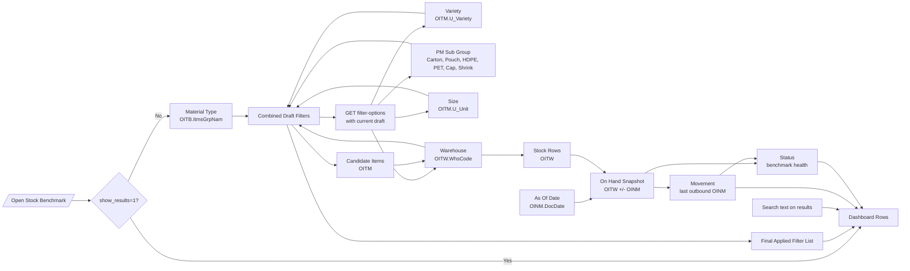

# Stock Benchmark Filter Flow

This flow maps how Stock Benchmark filters are connected in SAP and in the dashboard API. The dashboard no longer opens with the stock list first; it opens into this guided selection flow and only loads rows after the review step sends `show_results=1`.

## Recommended Order

Material Type -> Variety -> PM Sub Group -> Size -> Warehouse -> Review -> Results

Search stays on the results page because it is a global text modifier over item code, item name, and warehouse labels. Status and Movement remain API-supported, but the guided flow does not silently apply them.

## Flowchart

## Dependency Table

| Flow step | SAP source | Depends on | Changes |
|-----------|------------|------------|---------|
| Material Type | `OITB.ItmsGrpNam`, joined through `OITM.ItmsGrpCod` | None | Variety, PM Sub Group, Size, Warehouse |
| Variety | `OITM.U_Variety` | Material Type | PM Sub Group, Size, Warehouse |
| PM Sub Group | `OITM.U_Sub_Group` | Material Type, Variety | Size, Warehouse |
| Size | `OITM.U_SKU` | Material Type, Variety, PM Sub Group | Warehouse |
| Warehouse | `OITW.WhsCode` | Candidate item set | Stock rows, grouped rows, Status |
| Review | URL query filters | All selected flow steps | Results table load |
| Search | Item code, item name, warehouse text | Results loaded | Visible result rows |
| Status | Computed from `OnHand`, `MinStock`, and Movement | Candidate item set, Warehouse, Movement | Visible rows and summary counts |
| Movement | Last outbound inventory movement in `OINM` | Candidate item set | Status and visible rows |

`OITM.U_Unit` and `OITM.InvntryUom` remain API-supported, but they are not treated as pack size. The guided Size step uses `OITM.U_SKU`.

## Cascading Option Contract

The flow requests `GET /dashboards/stock/filter-options/` with the current draft filters. The backend scopes every SAP-backed option list to the draft while excluding the option group's own selected value, so a user can still revise the current step without the selected value hiding its alternatives.
